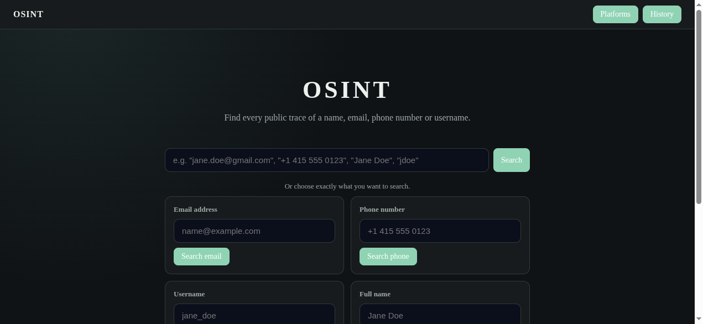
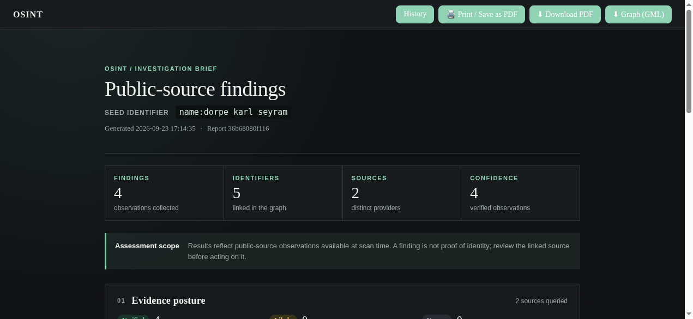
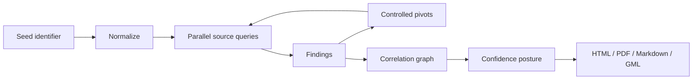

# OSINT

> A local, source-aware investigation workspace for correlating public identifiers into reviewable evidence briefs.

OSINT accepts an email address, phone number, username, name, or domain, queries enabled public sources in parallel, follows controlled pivots, and turns the results into a structured investigation report. The project is designed for authorized research, verification, and defensive investigations.

<p align="center">
  
</p>

## What It Does

- Normalizes emails, phone numbers, names, usernames, and domains.
- Runs source queries asynchronously with rate limits and failure isolation.
- Follows controlled identifier pivots up to a configurable depth.
- Builds a correlation graph of identifiers, sources, and co-occurrences.
- Assigns evidence posture: `verified`, `likely`, or `unsure`.
- Persists reports as JSON and exports PDF, Markdown, and GML.
- Provides a local FastAPI web interface with search history.
- Supports optional API-backed and CLI-backed sources without making them mandatory.
- Caches source results locally to reduce repeated requests and API usage.

## Report Experience

The report is presented as an investigation brief rather than a raw result dump. It includes:

- Executive metrics for findings, identifiers, sources, and verified observations.
- An assessment-scope notice explaining what the evidence does and does not establish.
- Confidence posture with definitions for each evidence level.
- Source coverage showing which providers contributed observations.
- An identifier map ranked by corroboration.
- An evidence ledger with source links and expandable source metadata.
- A pivot trail showing how related identifiers were discovered.
- Print-friendly styling and a matching downloadable PDF.

<p align="center">
  
</p>

## Quick Start

### 1. Create an environment

```bash
cd /home/hackura/OSSINT
python3 -m venv .venv
source .venv/bin/activate
python -m pip install --upgrade pip
python -m pip install -r requirements.txt
```

On Windows PowerShell, activate with:

```powershell
.venv\Scripts\Activate.ps1
```

### 2. Configure optional sources

```bash
cp .env.example .env
```

Edit `.env` and add only the credentials for sources you intend to use. `.env` is ignored by Git.

### 3. Start the web app

```bash
python run_web.py
```

Open [http://127.0.0.1:8000](http://127.0.0.1:8000).

The web interface provides:

- Universal auto-detect search.
- Type-specific email, phone, username, and name searches.
- Platform-focused search shortcuts.
- Search history.
- Browser print / Save as PDF.
- Direct PDF and GML downloads.

### 4. Run the CLI

```bash
python -m osint "jane.doe@gmail.com"
python -m osint "+1 415 555 0123"
python -m osint "Jane Doe"
python -m osint "jane_doe"
python -m osint "example.com"
```

Useful options:

```bash
python -m osint "Jane Doe" --max-depth 1
python -m osint "jane_doe" --sources github,telegram
python -m osint "jane_doe" --exclude-sources maigret
python -m osint "jane.doe" --type username
python -m osint "jane_doe" --no-cache
python -m osint "jane_doe" --output investigation_jane
```

CLI output is written as `<prefix>.md` and `<prefix>.gml`.

## Configuration

Copy `.env.example` to `.env`:

| Variable | Purpose |
| --- | --- |
| `HIBP_API_KEY` | Enables Have I Been Pwned breach lookups. |
| `SERPER_API_KEY` | Enables search-engine x-ray queries through Serper. |
| `TELEGRAM_API_ID` | Telegram API application ID. |
| `TELEGRAM_API_HASH` | Telegram API application hash. |
| `OSINT_PROXY` | Optional proxy for shared HTTP lookups. |
| `OSINT_CACHE_PATH` | Optional cache file location. |
| `OSINT_CACHE_TTL` | Cache lifetime in seconds; defaults to 86400. |
| `OSINT_NO_CACHE` | Set to `1` to disable caching. |

Example:

```dotenv
HIBP_API_KEY=your-key
SERPER_API_KEY=your-key
OSINT_CACHE_TTL=86400
```

Missing credentials do not stop the pipeline. The corresponding source simply returns no findings.

## Optional CLI Sources

The wrapper sources are discovered from `PATH`:

```bash
source .venv/bin/activate
python -m pip install maigret socialscan
```

Verify them with:

```bash
command -v maigret
command -v socialscan
```

| Source | Identifier types | Setup |
| --- | --- | --- |
| Maigret | Username | `pip install maigret` |
| Socialscan | Email, username | `pip install socialscan` |
| Telegram phone lookup | Phone | `TELEGRAM_API_ID`, `TELEGRAM_API_HASH`, and Telethon login |
| HIBP | Email | `HIBP_API_KEY` |
| Serper dorks | Name, username, email, phone | `SERPER_API_KEY` |

## Built-in Sources

| Source | Handles | Evidence |
| --- | --- | --- |
| Gravatar | Email | Profile JSON and linked pivots |
| GitHub | Username | Public profile confirmation and profile fields |
| Reddit | Username | Public profile endpoint |
| Telegram username | Username | Public username page |
| Phone metadata | Phone | Country, carrier, timezone, and line type |
| Maigret | Username | Multi-site profile sweep |
| Socialscan | Email, username | Platform registration results |
| Serper dorks | Name, username, email, phone | Search-engine result links and snippets |
| HIBP | Email | Known breach exposure |
| Telegram phone | Phone | Contact-import result when configured |

All source calls are isolated behind the source API. A timeout or failed optional module does not terminate the overall run.

## Architecture



Project layout:

```text
osint/
  models.py          identifiers, findings, confidence enums
  normalizers.py     email, phone, name, username, domain handling
  orchestrator.py    async waves, pivots, source selection
  graph.py           NetworkX correlation graph
  reporting.py       Markdown, JSON, and GML serialization
  cache.py           local TTL cache
  sources/           native and optional source adapters
webapp/
  server.py          FastAPI routes and report preparation
  store.py           JSON report persistence
  pdf_export.py      investigation-brief PDF renderer
  templates/         HTML views
  static/            responsive and print CSS
```

## Reports and Storage

Web reports are stored under `reports/` as JSON files. The web application also exposes:

- `/report/{id}`: HTML investigation brief.
- `/report/{id}/pdf`: downloadable PDF brief.
- `/report/{id}/gml`: graph export for Gephi, yEd, or other graph tools.
- `/history`: saved report history.

The local cache is `.osint_cache.json` by default and is ignored by Git. Do not commit API keys, Telegram session files, private reports, or other sensitive investigation data.

Regenerate the source blueprint PDF with:

```bash
python build_pdf.py
```

This writes `OSINT_Blueprint.pdf`.

## Testing

Run the test suite with:

```bash
python -m pytest -q
```

The tests cover normalization, coercion, confidence classification, cache behavior, graph serialization, and feature integrations.

## Evidence Model

- **Verified**: the target service explicitly confirmed the resource, such as a public profile response.
- **Likely**: a credible source or search result supports the association, but identity is not fully confirmed.
- **Unsure**: the signal is collision-prone, weak, or requires manual review.

A matching username, name, phone number, or email address is not by itself proof that two records belong to the same person. Review the original source and preserve appropriate context before making a decision.

## Responsible Use

Use this project only for authorized investigations and lawful defensive research. Respect applicable privacy and data-protection requirements, platform terms, rate limits, and source restrictions. Do not use the output for employment, credit, housing, tenant screening, harassment, or other high-impact decisions without appropriate legal, procedural, and human review.

## License

No license file is currently included. Add a license before distributing the project or accepting external contributions.
